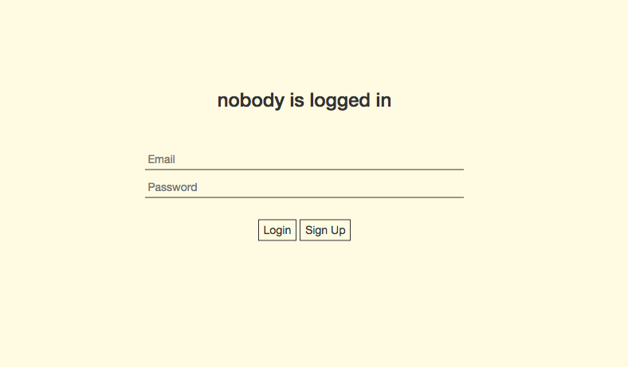
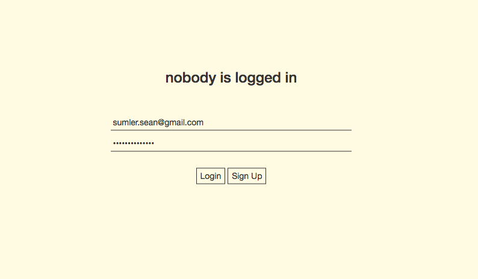
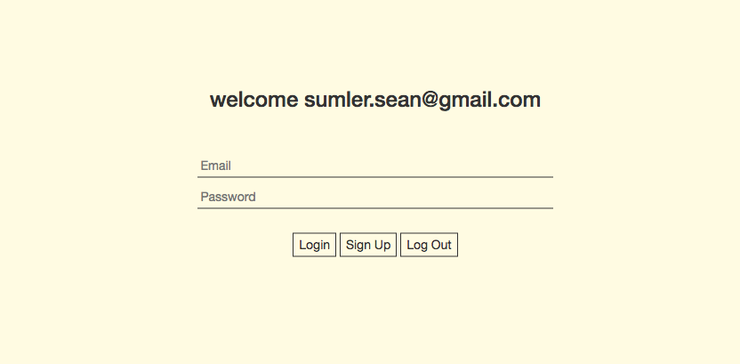

## Firebase Authentication

This repo was created as an independent exercise to better understand how <a href="https://firebase.google.com">Firebase</a> manages user authentication.

### Views

**Nobody is logged in**  


**Enter your info**  


**Welcome!**  



### Usage
_note: for testing, a firebase account is necessary_
* Sign into your Firebase console
* Create a new database with <a href="https://firebase.google.com/docs/database/security/quickstart">read, write rules set to "true"</a>
* Download repo
* In the root of the local repo create a file called **api-keys.js**  
* in the api-keys file, write:
  ```
  var masterFirebaseConfig = {
    apiKey: "Your API info",
    authDomain: "Your API info",
    databaseURL: "Your API info",
    projectId: "Your API info",
    storageBucket: "Your API info",
    messagingSenderId: "Your API info"
  };
  ```
* replace "Your API info" with your new database information _(located in Database > Overview > Add Firebase to your web app)_
* Sign Up, Sign In, Sign Out!

### Author, contact
Sean Pierce, sumler.sean@gmail.com

#### License
MIT &copy; 2017
